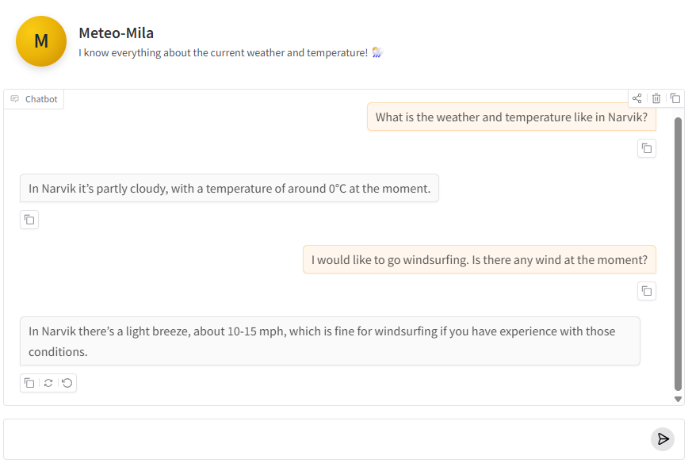
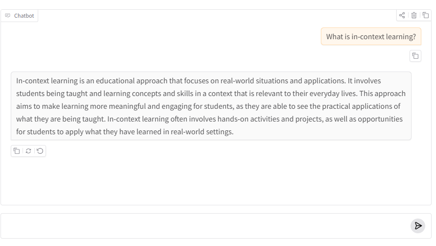
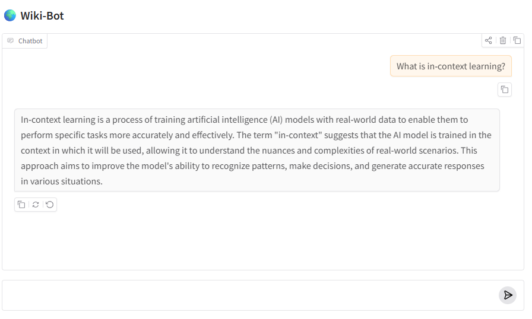
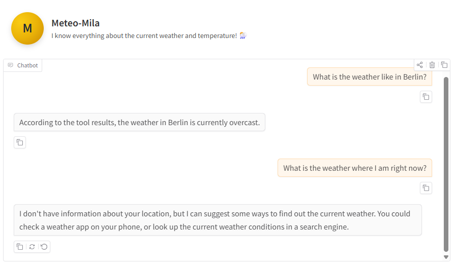
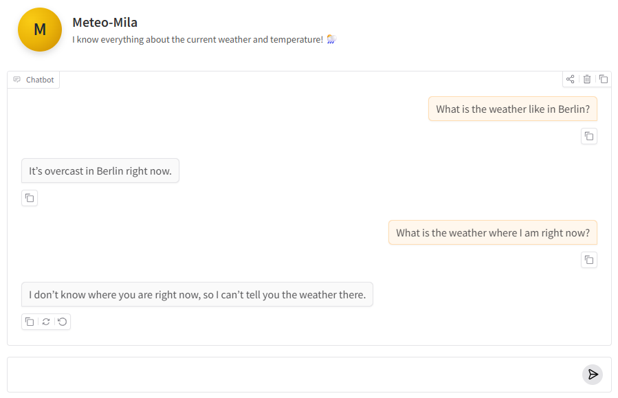

# finetuning-llama-instruct

This repository contains code for finetuning **Llama-3.2-3B-Instruct** on the **FineTome-100K** dataset and on **a synthetic function calling dataset**. We include a full evaluation pipeline to compare the base model to the finetuned models. We also provide a live demo of the chatbots where the models are used in an agentic framework.

---
This README.md file acts as both a description of the repo but also as a diary of what we have learned and motivations of our design choices along the way.

## Agent Demo
You can try all our models here:  
**([huggingface space](https://huggingface.co/spaces/MJ-Group/agent-and-icl-demo))**

In our demo we include the following models:
- Default *Llama-3.2-3B-Instruct*
- Finetuned *Llama-3.2-3B-Instruct* on FineTome-100K
- Finetuned *Llama-3.2-3B-Instruct* on Synthetic-FuncCall-Small

You can switch between the models and use them as:
- A weather assistant with access to LIVE weather data
- A general chatbot
- A researcher 

The LIVE weather assistant utilize an agentic framework with tools such as fetching current weather from an API. For example the user might ask how cold it is or what the current weather is in Oslo. Then the LLM will utilize the tools through function calling to get the necessary information to answer the user. We followed the official function calling format for Llama-3.2 ([link](https://www.llama.com/docs/model-cards-and-prompt-formats/llama3_2/)). One problem with this format is that when tools are available, but no tool is needed, we are forced to do two calls to the LLM anyway. In some other formats this is not necessary. We circumvented this by finetuning on a synthetic dataset.

Below we provide an example conversation from our LIVE weather assistant:

Here is the difference between a normal chatbot and our wiki researcher that has access to up to date information.

**Normal chatbot**

**Wiki researcher**

In our agentic framwork we had to limit ourselfes to use an agentic framwork with a maximum of two LLM calls per user prompt. We would have like to use a loop but our model was simply too slow on CPU to make the chatbot demo work in a reasonable time with such an implementation. We could easily adapt the code to use a loop but then a fast LLM would be needed, e.g. though OpenAI:s API, which was not the point of this task.

For the exact details of the implementation of the agent we refer to the code in the **([huggingface space](https://huggingface.co/spaces/MJ-Group/agent-and-icl-demo/))**.

---

# Fine-tuning
Fine-tuning is implemented in **/FineTome/finetuning.ipynb** and **/FuncCall/finetuning.ipynb** following the workflow from **([link](https://huggingface.co/blog/mlabonne/sft-llama3))**.  
We train a LoRA-adapted model and export the models in GGUF format such that they can be run on a CPU on the huggingface space.

## Evaluation and Finetuning on FineTome

We started by finetuning on the FineTome-100K datset. In the first finetuning run we used 5000 samples from the dataset and trained for 3 epochs. After looking at the evals we realized that the model became worse at everything. Especially on the tasks included in the training set (which you usually shouldn't test on but this was for debugging purposes). We realized that the objective of the finetuning on FineTome was to improve the models instruction following capabilities. The examples in FineTome are ordered in highest score to lowest, we hypthize that instruction quality will improve more if the model sees more examples and don't rerun the same examples. Because of this and the scoring ordering we  run the first 20000 samples for 2 epochs. Here we got a slighly better result on the evals and kept this as our final model. More details below.

The evaluations used were:

- **Benchmark evaluations** (ARC-Challenge).  
- **Pairwise preference tests** on a held-out subset of FineTome-100K (not used during training) using an LLM-as-a-judge (GPT-4.1-mini).

The evaluation pipelines are implemented in **/FineTome/eval_benchmark.ipynb** and **/FineTome/eval_llm_judge.ipynb**.

### Findings from benchmark evaluation
Instruction tuning usually doesn't add world knowledge. We learn that finetuning can yield both wanted and unwanted consequences. For example, our finetuned model becomes slightly worse at multiple choice questions on the ARC-challenge dataset compared to the default model.

This makes sense; this is known as the "Alignment Tax." By optimizing the model for conversational style (FineTome), we slightly degraded its raw abstract reasoning capabilities. Note that this result could also be within noise and the experiment would have needed to be run multiple times. 
By optimizing the model for a specific conversational style (FineTome) and strict tool syntax, we slightly degraded its raw abstract reasoning capabilities.Yet we use this as an indicator that we need to be careful about the objective of our finetuning and realize that for our UI inference it would make more sense to finetune the model on task-specific tool-calling data rather than general open-ended conversation data.

| Benchmark     | Default model (%)        | Fine tuned on FineTome (%) |
| ------------- |-------------| -------------|
|ARC-Challenge     |  41.2|  39.6|

### Findings from pairwise preference test evaluation
When creating the pairwise preference tests we note that in some cases the reference answer is worse than both that of our default and finetuned model (check below for an example of this). Therefore we decide to omit inluding the reference when passing the answers from the two models to the LLM judge.

**Example of training data problem** (Sample 5000 in FineTome-100K, full sample in assets/reference_problem.txt)

🎯 PROMPT

Solve the following math problem step-by-step.  
Simplify your answer as much as possible.  
Present your final answer as `\boxed{Your Answer}`.  
The volume of a cube is 1000 cc. Find its surface area.

📘 REFERENCE ANSWER

Step 1: Volume formula: `V = s^3`  
Step 2: Solve for `s`: `s = V^(1/3)`  
Step 3: `s = 1000^(1/3) = 10`  

**Answer:** `\boxed{10}`

🤖 BASE MODEL ANSWER

Side length: `10`  
Surface area: `6 × 10² = 600`  

**Final:** `\boxed{600}`

🚀 FINETUNED MODEL ANSWER

Same steps but cleaner and more concise.  
Final answer: `600`.

**Final:** `\boxed{600}`

We also make sure that the preference of the LLM judge align with human preferences reasonably well (a 100% alignment is not possible since humans also are prone to error or bias when judging). We then let the LLM evaluate 100 prompts from our FineTome test set.

We note that we could have made the evaluation better (less bias, more accurate, precise etc) by a more in depth analyze here.

gpt-4.1-mini as a JUDGE :
| Benchmark     | Default model [tot wins]        | Fine tuned on FineTome-20K [tot wins]| [ties] | 
| ------------- |-------------| -------------| -------------|
|100 samples from the training set run two times    | 79  |75 | 46 |
|100 samples from FineTome NOT in the training set run two times    | 81  |63 | 56 |

We run each experiment two times where in the second expirement the answers from the models are presented in a flipped order. This is to account for common bias where the LLM picks the first option more often. Further improvements of the eval would have yielded more reliable results. We also tried playing around with the judge prompt to better evaluate what finetome actually might improve, better instruction following. The result was very similar irregardles of the judge prompt.

## Evaluation and Finetuning on Synthetic Function Calling Dataset
To improve our agentic framework we finetune our model on a synthetic dataset built such that the function calling will work better and faster. This is especially useful in this case since the original function calling template ([link](https://www.llama.com/docs/model-cards-and-prompt-formats/llama3_2/)) makes it hard to support answering in one prompt during edge cases. An example is shown below:

**Before finetuning on function calling dataset**

**After finetuning on function calling dataset**

We did this to further increase our understanding of when finetuning can be beneficical (and when not). We note that it is especially useful for edge cases, like when the model should not call a function but still does. It also improves the output drastically, which we could not achieve with ICL or prompt engineering in this case (we tried a lot!). We also note that since we use specific system messages tailored either for function calling or when receiving an executed function this finetuning of the model does not make it worse at other tasks. This finetuning does come at a cost though, the model can make some weird hallucinations that were not present before the finetuning. A larger higher quality training set would probably solve this issue. 

**Pairwise preference test**
gpt-4.1-mini as a JUDGE :
| Benchmark     | Default model [tot wins]   | Fine tuned on FuncCall [tot wins]| Ties | 
| ------------- |-------------| -------------| -------------|
|50 samples from FuncCall test set | 10  |24 | 16 |

---

## In-Context Learning (ICL)
We tried applying ICL and it was fun but for the agentic framwork we had to omit the approach for faster responses, the ICL didn't give the gain we hoped for. Also, some responses had examples weirdly attached in the output. We will explore this further for other models though (like gpt-4.1 for example).

## Real-time API Integration
The HuggingFace Spaces demo includes real-time API calls for tasks such as retrieving current weather or temperature data. For the weather tasks Open-Meteo is used. We use the Wikipedia package for our "research" bot.

---

## Motivation behind not using other improvement strategies

### Hyperparameter Tuning
We debated on whether or not to experiment with the **Successive Halving Algorithm (SHA)** for hyperparameter search, as introduced in the course.  
Our working hypothesis is that gains over default LoRA hyperparameters will be limited and since the instruction explicitly state that we need to show improvements to reach the top grade we omit this approach.

## Limited resources
https://huggingface.co/blog/mlabonne/sft-llama3
As stated here, training the model on the entire dataset (100k samples) using an A100 GPU (40 GB of VRAM) on Google Colab took 4 hours and 45 minutes. In our case we are limited to a T4 which according to the link above takes 47 hours. Therefore we opt for a smaller size of the FineTome-100K dataset.

## (Not included but extra insight)
We also try finetuning the same base model (Llama-3.2-3B-Instruct) on a synthetic generated avalanche dataset. The idea is that we want our LLM to act more as an avalanche expert and correctly be able to help when a user asks questions related to avalanches. We generate the dataset using GPT-5.1 and also generate a test set of 100 samples which we use for evaluation.

We first try finetuning the model on 5000 samples for 3 epochs, we notice quite heavy overfitting and some hallucinations in the result, still the finetuned model outperforms the base model by a whopping 100% winrate on a test set of 100 samples, not used during training. We still want to improve the model and generate 1000 higher quality samples which we finetune only for 1 epoch. The resulting chatbot  ended up being really good. Interesting!

From this example we learn that you have to carefully monitor overfitting and ideally finetune as little as possible to let the model remain good at other tasks. During the training of our final finetuned model we carefully monitor the training loss.

---